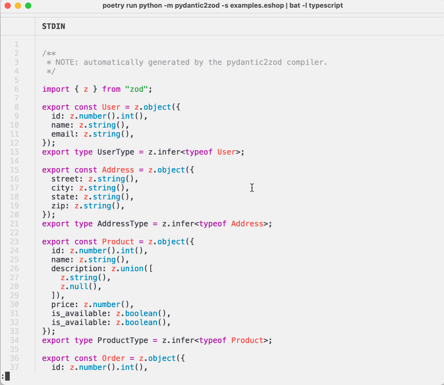

# Pydantic to Zod compiler

Transfer your type safe Python data models to TypeScript:
[pydantic](pydantic-docs.helpmanual.io/) -> [zod](zod.dev/).

* Retains the class and field names, comments.
* Customize the output, etc.
* Suports both **pydantic** v1 and v2.

See the [docs](docs.md).

## Similar projects

* https://github.com/cs-cordero/py-ts-interfaces
